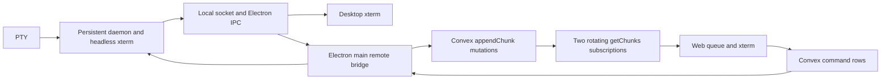
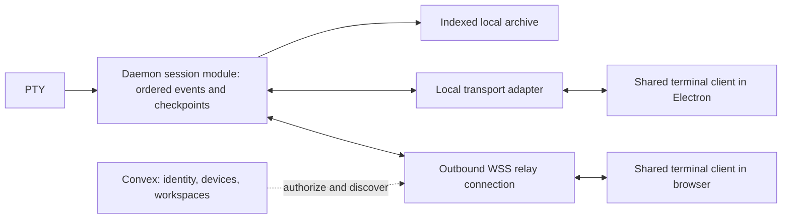

# Terminal streaming refactor

Status: architecture proposal and measured investigation; no production migration implemented.

A [runnable single-session prototype](../../apps/desktop/experiments/terminal-stream/README.md) now exercises the Node WebSocket baseline, exact event replay, independent viewer backpressure, and automatic reflow. Its README records measured checks and remaining production work.

Investigated September 11, 2026, against Orchestra `d58f6e2`. Installed terminal versions: xterm/headless 6.0.0, serialize 0.14.0, WebGL 0.19.0. Recheck external project versions before implementation. This proposal supplements, rather than describes the shipped behavior in, [terminal-interface.md](terminal-interface.md). Replace this proposal with the accepted design and benchmark results when the migration lands.

## Recommendation

Build a terminal session protocol owned by the persistent daemon. Carry live output and input over a dedicated, resumable binary WebSocket connection. Keep Convex for device discovery, authorization, workspace state, and other durable product data. Use one shared terminal client implementation in Electron and the browser, initially with the installed xterm.js engine. Introduce persistent, indexed history independently of the bounded live terminal buffer.

For a Rust investment, a small Tokio/axum relay is a sensible first target: bounded connection queues, outbound desktop connections, and protocol forwarding. Preserve the existing Node PTY daemon initially. Rewriting PTY lifecycle and terminal emulation simultaneously would make it difficult to determine which change improved or broke fidelity. Compare the Rust relay with a minimal `ws` implementation under the same load; language alone is not evidence of better end-user latency. [Axum WebSocket interface](https://docs.rs/axum/0.8.9/axum/extract/ws/index.html).

Run a separate Ghostty web engine comparison using the same recordings and client contract. Adopting Ghostty would mean adopting its web renderer and state semantics on both surfaces, not receiving the native Ghostty renderer in the browser. See the [external source investigation](terminal-streaming-sources.md).

## What the current code establishes



These are source findings, not inferred browser profiles:

| Finding | Evidence | Architectural consequence |
|---|---|---|
| Both surfaces already use xterm 6 and WebGL. Desktop starts at 14px and web at 13px. | [Desktop initialization](../../apps/desktop/src/renderer/src/hooks/useTerminal.ts), [web initialization](../../apps/web/src/components/Terminal.tsx) | Shared engine alone has not produced shared behavior; font metrics, geometry, lifecycle, and configuration also need one owner. |
| Output is batched at 16 ms / 16 KiB thresholds, inserted into database rows, then read in batches of at most 500. | [Bridge](../../apps/desktop/src/main/remote-bridge.ts), [remote functions](../../apps/backend/convex/remote.ts) | Interactive output depends on mutation and query delivery. The current socket is a database subscription transport, not a dedicated PTY stream. |
| Web alternates two subscriptions to cover registration gaps, merges their results, and advances cursors after enqueue. | [TerminalPane](../../apps/web/src/components/Terminal.tsx), [chunk folding](../../apps/web/src/lib/chunk-buffer.ts) | Queue admission is treated as consumption; there is no end-to-end acknowledgement that the terminal parser applied an offset. |
| Seeds reset xterm; overflow requests another attach. Queue limits are 2 Mi characters pending and 32 Ki characters per write. | [Terminal writer](../../apps/web/src/lib/terminal-writer.ts) | Large recovery operations replace visible history and stop momentum. The limits count JS characters, not wire bytes. |
| Daemon snapshots retain 2,000 scrollback rows; both UIs retain 10,000. The writer restores distance from the current bottom. | [Headless emulator](../../apps/desktop/src/daemon/headless-emulator.ts), [writer](../../apps/web/src/lib/terminal-writer.ts) | Replacing a mature buffer can remove the content the user is reading. Distance from bottom is not stable content identity. |
| A web geometry claim resizes every persisted session; ownership is desktop/web, not a per-viewer lease for one session. | `claimGeometryWeb` and `resizeAllSessions` in [bridge](../../apps/desktop/src/main/remote-bridge.ts) | Opening or resizing a web view can have effects outside the viewed terminal. |
| Attach clears the shared chunk log. Snapshot fields contain ANSI, modes, cwd, cols, rows, but no daemon stream offset or incarnation. Post-snapshot holding begins after the snapshot RPC returns. | [Bridge attach](../../apps/desktop/src/main/remote-bridge.ts), [protocol](../../apps/desktop/src/daemon/protocol.ts) | There is no explicit protocol proof that a snapshot and its live suffix meet at exactly the same position. The distributed handoff warrants a race test; source inspection alone does not establish a particular lost-output race. |
| Output rows older than five minutes are eligible for cleanup. The chunk fold sorts/deduplicates but does not reject sequence holes. | [Cleanup](../../apps/backend/convex/remote.ts), [chunk folding](../../apps/web/src/lib/chunk-buffer.ts) | A stale consumer cannot prove it has a contiguous VT stream simply because a later sequence arrived. |
| Disk history stores raw output, caps at 5 MiB, restores at most a 512 KiB tail, and updates current geometry in metadata. | [History writer](../../apps/desktop/src/daemon/history-writer.ts) | This is not an indexed recording of output plus every resize, and arbitrary tails are not self-contained terminal checkpoints. |

### Controlled experiments

Run from the repository root:

```sh
bun docs/architecture/terminal-streaming-probe.ts
```

The probe imports the real daemon emulator and chunk-folding function. It creates disposable in-memory terminals and uses synthetic numbered lines; it does not connect to a user's PTY.

Observed output:

```json
{"experiment":"5000 lines, replace from actual daemon snapshot","localLines":5001,"restoredLines":2024,"localBaseY":4977,"restoredBaseY":2000,"beforeAnchor":"row-01000","afterAnchor":"row-02977","seedBytes":22253}
{"experiment":"sequence gap input 1, 3","actual":{"data":"AC","afterSeq":3,"reset":false}}
```

The first result confirms history loss on snapshot replacement and the consequence of applying the writer's current anchor formula. It does not simulate browser painting. The second confirms acceptance of a synthetic hole, not that a particular live connection has lost bytes.

Existing targeted tests passed: **3 files, 35 tests**, covering terminal writer, scrolling, and geometry. These unit tests do not establish long-session visual fidelity. No Electron/native-app automation, production session interaction, network benchmark, or hardware phone test was performed.

## Define fidelity before choosing an engine

At a given session incarnation and output offset, clients should agree on cells, attributes, cursor, modes, active buffer, and PTY geometry. Pin the font asset, Unicode width rules, theme, and engine version as part of compatibility. Pixel-identical rasterization across different GPUs, operating systems, and device pixel ratios is a separate and generally unsuitable acceptance condition.

Accepted product behavior: the active web viewer automatically reflows the shared session to its viewport. The daemon grants one geometry lease per session; background/passive viewers adopt that grid and cannot resize it concurrently. Foreground/activation chooses the controlling web viewport, and its settled viewport changes produce ordered resizes. A narrow phone changes the shared PTY's columns; it cannot independently rewrap that PTY while the desktop preserves a different interactive layout.

Normal-buffer history is local scrolling. Alternate-screen history belongs to the running program: scrolling may require mouse or key input and a network round trip. Do not infer program history position from a count of sent wheel events, or claim arbitrary arrow-key bursts reliably mean “latest.” Passive viewers browse a recorded historical view; only the current controller sends application navigation. Remote latency cannot be eliminated by changing the terminal renderer.

## Proposed ownership and modules



**Session module, in the daemon.** Own PTY lifetime, ordered output and resize events, checkpoint creation, history retention, input deduplication, and per-session control leases. Electron main becomes a local transport adapter; closing or stalling its renderer must not redefine the session stream. The daemon must remain running and the machine awake for a live PTY; a relay cannot make a sleeping desktop execute commands.

**Terminal client module, shared by both UIs.** Present a small interface: attach/dispose, input, request/release control, viewport update, history navigation, and status subscription. Internally own parser writes, acknowledgements, reconnection, font readiness, rendering, and scroll anchors. React receives coarse status changes; it does not concatenate or reconcile every output batch. Existing local socket and remote WSS are two real transport adapters behind this seam.

**History module.** Own immutable event segments, checkpoint indexes, retention, and stable history positions. A live xterm stays bounded. Historical browsing reconstructs a nearby checkpoint into a separate bounded view and reads pages with cancellation and a bounded cache. Do not prepend arbitrary ANSI to the live emulator. Do not promise that xterm's native scrollbar automatically virtualizes a million archived rows; implement and test the transition between live history and archived history explicitly.

**Relay module.** Route authenticated session connections and enforce bounded per-viewer queues. It does not parse terminal escape sequences or store each frame in a database. A desktop connection goes outbound over WSS, avoiding an inbound port requirement. Operate the relay on hosting that supports long-lived WebSockets. Bind short-lived connection credentials to device, session, viewer, and allowed actions; validate origins and lease versions. Redact payloads from routine relay logs. This is a new deployable service with monitoring, reconnect handling, and operating cost.

## Protocol invariants

1. **One source of ordering.** Assign an incarnation ID when the PTY is created. Number all output and resize events at daemon ingress, before fan-out. Include a cumulative UTF-8 byte offset for output flow control; event sequence and output-byte offset are different fields. Use a defined 64-bit representation rather than unbounded JavaScript numbers. Never deduplicate bytes from two PTY incarnations together.
2. **Atomic checkpoint plus suffix.** An attach operation atomically reserves the event suffix and captures a checkpoint through event N. Return geometry, compatible engine/state format, N, output offset, active buffer, and required mode state. Stream N+1 onward, buffering it with a hard bound while hydration completes. Freeze serialization at the same cut as N. Calling a snapshot RPC and then independently subscribing is insufficient.
3. **Checkpoint completeness is a gate.** ANSI serialization is not a complete parser-memory dump. At a cut inside UTF-8, CSI, OSC, or DCS input, preserve the necessary parser continuation or choose a demonstrably safe cut and replay its suffix. Audit modes and extension state that serialize does not cover. Restore at the checkpoint's original geometry, then apply ordered resize events. Prove snapshot-plus-suffix equivalence before relying on the format; use replay from an earlier validated checkpoint when necessary.
4. **Resume without replacement when possible.** Reconnect with incarnation and last applied event/output offset. Send the missing contiguous suffix if retained. Reject holes and incompatible incarnations explicitly. If a checkpoint is required, hydrate a bounded staging terminal and swap only when ready; keep the reader's archived anchor. Do not reset the visible terminal on ordinary output, a heartbeat, focus, or every resize.
5. **Acknowledge parsing, not receiving.** Track received and applied positions separately. Credit is returned after parser write callbacks, coalesced across batches. Render scheduling is independent, so background-tab animation throttling cannot silently become the protocol's progress signal. Use byte windows and high/low watermarks, not a round trip for each frame. This follows the mechanism described in [xterm's flow-control guide](https://xtermjs.org/docs/guides/flowcontrol/).
6. **Slow viewers are isolated.** Pause a viewer's delivery when its window is exhausted. Keep authoritative parsing and disk recording bounded independently. If its retained suffix expires, require resynchronization instead of accumulating memory or dropping arbitrary bytes. A slow phone must not freeze an active desktop. If daemon parsing or durable recording itself cannot keep up, backpressure the PTY; define a disk-full policy rather than claiming lossless output with finite storage.
7. **Resize is ordered state.** A lease identifies one controller per session, with a monotonically changing lease version. Only that controller can request PTY resize or interactive input. Reject stale requests. Passive viewports only change presentation. Record the actual PTY resize alongside output and make every client apply that same order. Avoid global resizing of unrelated sessions and resize nudges as routine repaint requests.
8. **Input has bounded retry semantics.** Associate input IDs with connection/incarnation and lease version. Dedupe retransmits while that incarnation exists; acknowledge daemon acceptance, not an imagined command result. Do not blindly replay uncertain keystrokes after a daemon crash. Preserve input order and protect Ctrl-C/control traffic from bulk output queues. One authoritative terminal-query responder prevents multiple attached emulators from answering the same device query.
9. **History identity survives output.** Use a stable archive event/line identity plus viewport offset, not distance from the moving bottom. Keep explicit following/reading state. Retention or reflow that invalidates a location must resolve to a documented position or show history expiration. Record geometry and timing so historical reconstruction reflects what was actually rendered.

Raw PTY bytes are stateful: cursor moves, colors, carriage returns, erases, and alternate buffers are part of the content. A state-diff protocol is another valid architecture, but it requires an authoritative cell model, compatible client rendering, and separately preserved history. “Latest frame wins” is safe only for self-contained state frames with explicit bases, never for arbitrary ANSI chunks.

## Technology choices

| Candidate | Place in this proposal | Decision |
|---|---|---|
| Shared xterm 6 + headless + WebGL | Initial emulator and renderer | Lowest engine migration risk. Consolidating the client and replacing the stream/history infrastructure is already a substantial refactor. Serialization fidelity still requires tests. |
| Rust Tokio/axum | Dedicated WSS relay | Good bounded server implementation candidate; validate latency and resource use against a simple Node `ws` baseline. |
| Ghostty / libghostty-vt / ghostty-web | Alternative engine comparison | Ghostty is Zig. Evaluate compatibility, history behavior, and actual browser rendering, not native-terminal benchmarks. Current web write behavior is especially relevant to reading while output arrives. |
| Rust `alacritty_terminal` / `vt100` / WezTerm | Alternative authoritative terminal state or mux | Useful building blocks and architectural references. They do not supply Orchestra's shared browser renderer and resume contract as a drop-in package. |
| ttyd / WeTTY | Reference implementations or baseline remote shell | Demonstrate PTY-to-WebSocket-to-browser wiring. Adapting them must attach Orchestra's existing session, not spawn a second shell and call it mirroring. |
| SSH / Tailscale | Optional connection path | Authentication and reachability. A regular SSH session is not the already-running Orchestra PTY. A session attachment endpoint or mux is still required. |
| Mosh-style state synchronization | Alternative design reference | Strong reference for converging screen state over bad links. It does not by itself provide exact archived scrollback and browser integration. |
| Pixel/video streaming | Literal visual replication | Possible for pixels, but requires separate text/selection/accessibility/history channels; poor default for a terminal product. |

The external investigation links primary sources for these comparisons. For Tailscale specifically, an optional private WSS route can reuse the same protocol when both devices have network reachability; adding Tailscale SSH is not required for that. General browser clients still need a reachable HTTPS/WSS endpoint. [Tailscale SSH documentation](https://tailscale.com/docs/features/tailscale-ssh).

## Migration with evidence at each step

1. **Capture and measure a repeatable workload.** Create synthetic and consented, sanitized VT recordings with output, resize, and checkpoint events. Include long normal-buffer output, agent redraws, progress bars, alternate buffers, Unicode/emoji, Nerd Font glyphs, and escape sequences split across transport messages. Extend the current probe into a correctness oracle; collect the current browser baseline through Aside.
2. **Build one vertical session slice.** One synthetic PTY → daemon event log/checkpoint → dedicated relay → shared client in two surfaces. Prove contiguous live output, checkpoint-plus-suffix equivalence, reconnect, stable reading position, and independent slow-viewer limits. Keep the current product route available behind a transport flag while testing the new route. No production cutover is needed for this experiment.
3. **Consolidate the client and session ownership.** Extract renderer configuration, lifecycle, input, geometry, and scroll semantics into the shared module. Move stream ordering and control leases into the daemon. Replace data subscriptions and terminal command rows for sessions using the new transport; preserve unrelated Convex features.
4. **Implement indexed history.** Segment output and resize events with validated checkpoints, stable identifiers, and explicit retention. Make old-history browsing work with a bounded renderer/cache while new output continues. Historical terminal replay and an agent's semantic conversation history are distinct features.
5. **Compare alternative engines and servers.** Run xterm and ghostty-web against the same corpus and device/browser matrix. Evaluate a Rust relay against the Node baseline. Change the selected engine only if fidelity and interaction tests pass and the measured benefit justifies the migration.
6. **Roll out and remove the old machinery.** Canary by session/transport version. On rollback, reconnect through an explicit compatible checkpoint; never feed concurrent old/new streams into one terminal. After validation remove terminal chunk-row publishing, dual cursors, reset-based stall recovery, global geometry ownership, and duplicated UI terminal policy. Publish the accepted protocol, test corpus, and operating metrics.

## Acceptance targets for the experiment

These are proposed thresholds, not achieved measurements. Record hardware, browser, versions, session grid, fonts, network profile, and workload for every result.

| Area | Required evidence |
|---|---|
| Correctness | At matching event positions, zero unexpected cell/attribute/cursor/mode differences; compare semantic state and viewport screenshots. Test randomized chunk boundaries and checkpoint cuts. |
| Scrolling | A recorded history anchor remains unchanged during output and retained-offset reconnect; zero visible blank reset frames in ordinary live use. |
| Main thread | Aim for p95 frame time under 16.7 ms on the desktop reference and under 33 ms on the phone reference during continuous scrolling; inspect long tasks and dropped frames. |
| Remote interaction | At controlled 50/150/300 ms RTT, measure input-to-paint against the local rendering and network floor. Initial target: p95 overhead beyond that floor below 50 ms. Treat alternate-screen scrolling separately. |
| Long sessions | Replay 10 MiB and 100 MiB logs; browse an archive of at least 100,000 lines. After configured live/cache limits, memory should plateau while archive size grows on disk within retention. |
| Flow control | Sustain a throttled viewer while a fast viewer stays responsive; Ctrl-C remains usable under output flood. All queue sizes have observed, enforced bounds. |
| Recovery | Test disconnects during attach, resizing, input, and partial escape sequences; background/foreground; relay restart; desktop renderer restart; daemon/PTY restart as a new incarnation; expired history and disk-full behavior. |
| Compatibility | Real Chromium, Safari/iOS, and Android checks, normal and alternate buffers, DPR/font changes, selection, links, IME, soft keyboard, and WebGL context loss. Aside may automate browser fixtures; native/device results must be reported separately. |

The immediate implementation task is the single-session vertical slice with this fidelity oracle. Its result should choose the final transport implementation and determine whether an engine replacement is warranted.
